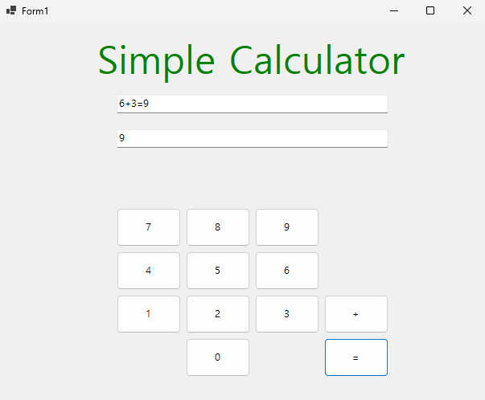
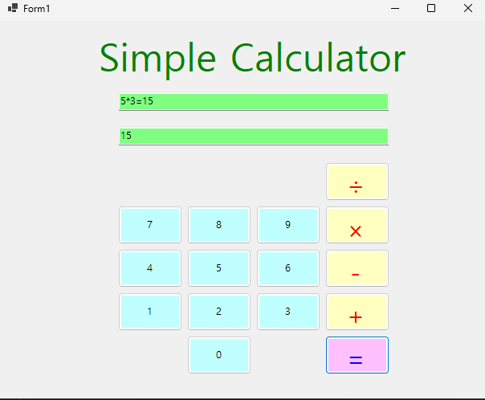
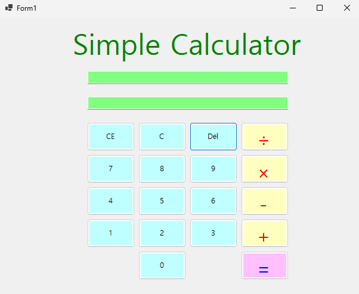
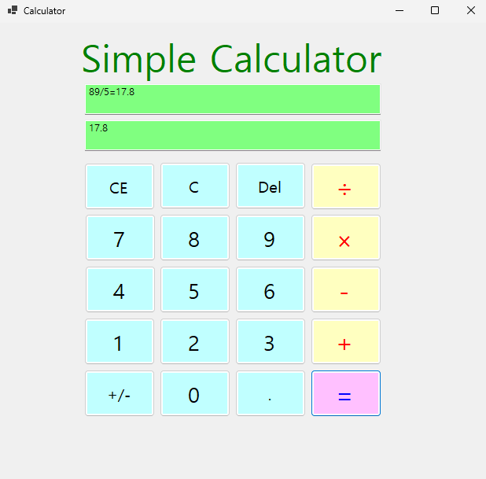

# (C# 코딩) Simple Calculator

## 개요
- C# 프로그래밍 학습을 위해 Windows Forms 환경에서 간단한 계산기 프로그램을 구현하였다. 사용자가 버튼을 통해 숫자를 입력하고 덧셈 연산을 수행한 뒤 결과를 출력하는 기능을 구현하였다.
- 1줄 소개: 사용자 입력을 받아 덧셈 연산을 수행하고 결과를 출력하는 계산기 프로그램
- 사용한 플랫폼: 
  - C#, .NET Windows Forms, Visual Studio, GitHub
- 사용한 컨트롤: 
  - Label,TextBox, Button
- 사용한 기술과 구현한 기능:
  - Visual Studio를 이용하여 UI를 구성하였다.
  - 버튼 클릭 이벤트를 통해 숫자 입력과 연산 기능을 구현하였다.
  - TextBox에 입력된 문자열 데이터를 int.Parse()로 정수형으로 변환하여 계산을 수행하였고 결과를 ToString()으로 다시 문자열로 변환하여 출력하였다.

## 실행 화면 (과제1)
- 과제1 코드의 실행 스크린샷  

- ![과제1 실행화면] 

- 과제 내용  
  - 숫자 버튼을 클릭하면 입력값이 TextBox에 문자열 형태로 누적되어 표시되도록 구현하였다.  
  - 사용자는 버튼을 통해 숫자를 입력하고 '+' 버튼을 눌러 연산자를 추가할 수 있다.  
  - '=' 버튼을 누르면 덧셈 결과가 계산되어 결과가 출력되도록 구성하였다.  
- 구현 내용과 기능 설명  
  - 사용자가 입력한 값은 TextBox를 통해 문자열(string) 형태로 처리된다.  
  - 이를 int.Parse()를 사용하여 정수형(int)으로 변환한 후 덧셈 연산을 수행하였다.  
  - 입력된 계산식은 '+'를 기준으로 분리하여 각각의 값을 정수로 변환한 뒤 계산을 수행하였다.  
  - 계산 결과는 ToString()을 사용하여 문자열로 변환하고 TextBox에 출력되도록 구현하였다.  
  - 계산식과 결과를 동시에 표시하여 사용자에게 직관적인 정보를 제공하도록 하였다.  

## 실행 화면 (과제2)
- 과제2 코드의 실행 스크린샷  

- ![과제2 실행화면] 

- 과제 내용  
  - 기존 덧셈 기능에서 확장하여 뺄셈(-), 곱셈(×), 나눗셈(÷) 기능을 추가하였다.  
  - 사용자는 숫자 버튼을 통해 값을 입력하고, 원하는 연산자를 선택하여 다양한 계산을 수행할 수 있다.  
  - '=' 버튼을 클릭하면 선택한 연산에 따라 결과가 계산되며, 계산식과 결과를 동시에 확인할 수 있도록 구현하였다.  
- 구현 내용과 기능 설명  
  - 연산자 버튼 클릭 시 현재 입력값을 기준으로 연산자를 저장하고, 이후 입력되는 값을 통해 두 번째 피연산자를 구성하도록 구현하였다.  
  - 입력된 계산식에서 연산자에 따라 문자열을 분리한 뒤 각각의 값을 int.Parse()를 이용하여 정수형으로 변환하였다.  
  - 연산자(op)의 값에 따라 덧셈, 뺄셈, 곱셈, 나눗셈을 수행하도록 조건문을 구성하였다.  
  - 곱하기와 나누기 기호(×, ÷)는 화면 표시용으로 사용하고, 실제 계산 시에는 *와 /로 변환하여 처리하도록 구현하였다.  
  - 계산 결과는 ToString()을 통해 문자열로 변환하여 TextBox에 출력되도록 하였으며, 계산식과 결과를 함께 표시하도록 구성하였다.  

## 실행 화면 (과제3)
- 과제3 코드의 실행 스크린샷  

- ![과제3 실행화면] 

- 과제 내용  
  - 기존 계산기에 입력 제어 기능을 추가하여 사용자가 입력값을 보다 자유롭게 수정할 수 있도록 구현하였다.  
  - C 버튼을 통해 전체 초기화 기능을 구현하였으며, CE 버튼을 통해 현재 입력값만 삭제할 수 있도록 하였다.  
  - Del 버튼을 통해 입력된 문자열의 마지막 글자를 하나씩 삭제할 수 있도록 구성하였다.

- 구현 내용과 기능 설명  
  - C 버튼 클릭 시 TextBox의 입력값과 결과값을 모두 초기화하고, 연산에 사용되는 변수(num1, op)도 함께 초기화하도록 구현하였다.  
  - CE 버튼 클릭 시 현재 입력 중인 TextBox의 값만 초기화되도록 구현하여 기존 결과값은 유지할 수 있도록 하였다.  
  - Del 버튼 클릭 시 Substring()을 이용하여 문자열의 마지막 글자를 제거하도록 구현하였으며, 문자열 길이가 0일 경우 오류가 발생하지 않도록 조건문을 추가하여 안정성을 확보하였다.  
  - 입력값을 직접 수정할 수 있는 기능을 통해 사용자 편의성을 향상시켰다. 

  
## 실행 화면 (과제4)
- 과제4 코드의 실행 스크린샷  

- ![과제4 실행화면] 

- 과제 내용  
  - 기존 계산기에 부호 변경(+/-) 기능을 추가하여 입력된 숫자의 양수와 음수를 전환할 수 있도록 구현하였다.  
  - 소수점(.) 입력 기능을 추가하여 정수뿐만 아니라 실수 형태의 숫자 입력이 가능하도록 확장하였다.  
  - 이를 통해 사용자는 보다 다양한 계산을 수행할 수 있으며, 실제 계산기와 유사한 입력 방식을 경험할 수 있도록 구성하였다.  
	
- 구현 내용과 기능 설명  
  - +/- 버튼 클릭 시 입력된 값의 앞에 '-'를 추가하거나 제거하여 부호를 변경하도록 구현하였다. 이를 위해 StartsWith()와 Substring()을 활용하여 문자열의 앞부분을 제어하였다.  
  - 소수점 버튼 클릭 시 TextBox에 '.'을 추가하되, 중복 입력을 방지하기 위해 Contains()를 사용하여 하나의 소수점만 입력되도록 구현하였다.  
  - 기존 계산 로직에서 사용하던 int.Parse()를 double.Parse()로 변경하고, 결과 변수 또한 int에서 double로 수정하여 실수 연산이 가능하도록 개선하였다.  
  - 이를 통해 5.2 + 2.3과 같은 소수 계산이 가능해졌으며, 나눗셈 연산에서도 보다 정확한 결과를 출력할 수 있도록 구현하였다.  
  - 계산 결과는 ToString()을 이용하여 문자열로 변환한 후 TextBox에 출력되도록 하였다.  

## 배운 내용

이번 과제를 통해 Windows Forms 환경에서 이벤트 기반 프로그래밍의 동작 방식을 실제로 구현하며 이해할 수 있었다. 특히 버튼 클릭 이벤트를 통해 사용자 입력을 처리하고, 그에 따라 프로그램이 동작하는 흐름을 익힐 수 있었다. 또한 TextBox에서 입력되는 값이 문자열(string) 형태라는 점을 이해하고, 이를 int.Parse()와 double.Parse()를 이용하여 정수 및 실수로 변환하는 과정이 필수적이라는 것을 배웠다. 과제1부터 과제4까지 진행하면서 단순 덧셈 기능에서 시작하여 사칙연산 확장, 입력 제어 기능(C, CE, Del), 그리고 부호 변경과 소수점 처리 기능까지 점진적으로 구현하면서 프로그램을 확장하는 경험을 할 수 있었다. 특히 ×와 ÷ 기호를 화면에 표시하면서 내부적으로는 *와 /로 변환하여 처리하는 과정에서 사용자 인터페이스와 실제 로직을 분리하는 개념을 이해할 수 있었다. 또한 구현 과정에서 이벤트 연결 문제, 문자열 분리 오류, 형 변환 오류(System.FormatException) 등을 직접 해결하면서 디버깅 능력을 향상시킬 수 있었고, 프로그램을 안정적으로 동작시키기 위해 조건문과 예외 상황 처리가 중요하다는 것을 깨달았다. 이러한 과정을 통해 단순 기능 구현을 넘어 프로그램의 전체 구조와 데이터 흐름에 대한 이해도를 높일 수 있었다.

